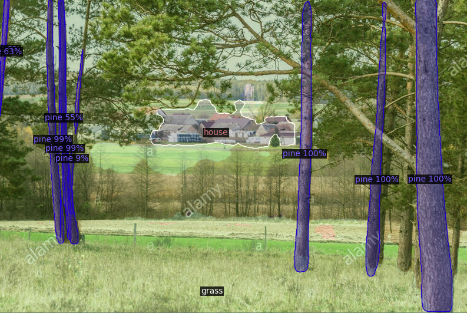
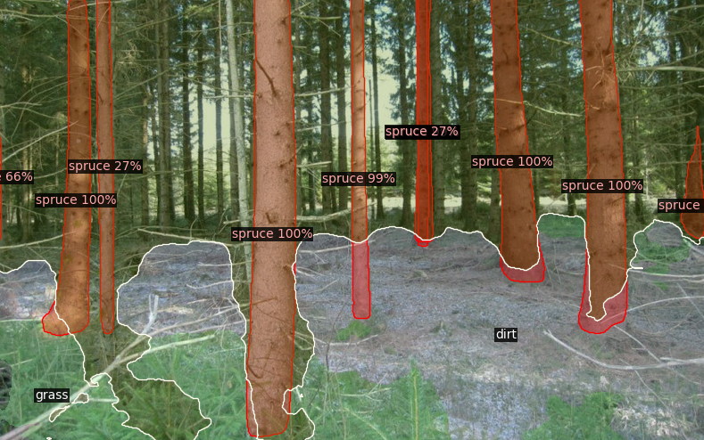

# Forest-vision

## General info
This project uses 2 models at the moment:
* Instance segmentation for stems and tree crowns, 3 * 2 classes (crown & stem): [pine, birch, spruce]
* Default model for semantic segmentation.

Code to combine both models inference result is also included.

## Contact
If you are interested in using the dataset (or the model) I created for the
instance segmentation of the classes mentioned above, please feel free 
to contact me.

## Read more
https://github.com/facebookresearch/detectron2